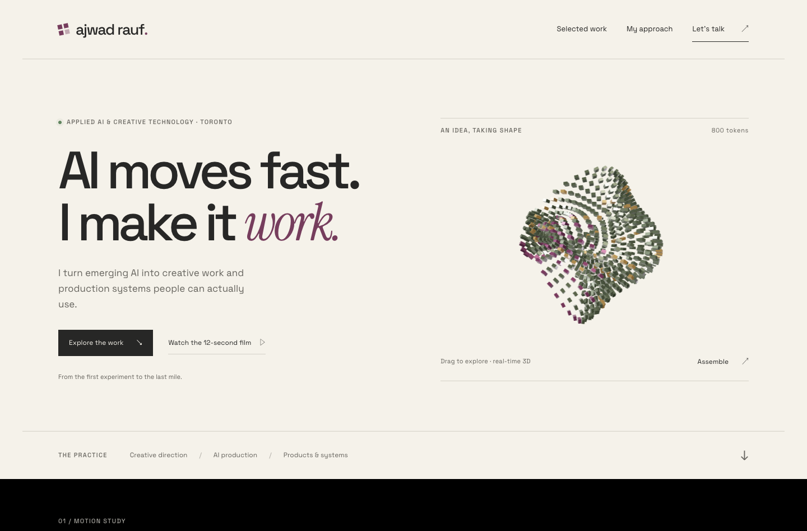

# Ajwad Rauf — homepage concept

**Start here: [Claude implementation handoff](CLAUDE_HANDOFF.md).**

A working homepage prototype with an interactive 3D token sculpture, the revised Blender film, selected projects, and a story about staying ahead through testing and building with AI.

This folder is on **`codex/homepage-concept`**, based on **`6ec61e6`** of `claude/loblaw-ai-content-studio-701jhf`. The application source has not been changed. The deploying branch has not been updated. The branch's root `vercel.json` disables automatic Vercel deployments specifically for `codex/homepage-concept` using [Vercel's documented branch setting](https://vercel.com/docs/project-configuration/git-configuration#gitdeploymentenabled).

## Preview

From the repository root:

```sh
cd design/homepage-concept
python3 -m http.server 8765 --bind 127.0.0.1
```

Open **http://localhost:8765**. No API keys, Next.js installation, or generation credits are needed. Use HTTP rather than double-clicking `index.html`, because the 3D component imports a JavaScript module.

Try **Assemble** in the hero, **Explore again**, dragging the sculpture, and playing the film. The video starts on request. Three.js and the media are included locally; Google Fonts requires an internet connection and has system-font fallbacks.

### Desktop



[Full desktop page](review/desktop-full.png) · [Assembled wordmark](review/desktop-assembled.png) · [Mobile page](review/width-390.png)

## What to use

| File | Purpose |
| --- | --- |
| `CLAUDE_HANDOFF.md` | Implementation scope, file mapping, behaviour and acceptance checks |
| `page-fragment.html` | Authoritative content and section structure |
| `styles.css` | Responsive layout, colours, typography and component styling |
| `app.js` | Working 3D, assembly, video and navigation interactions |
| `index.html` | Ready-to-run standalone page |
| `build_preview.py` | Portable builder; rerun after editing the HTML fragment |
| `assets/token-film.mp4` | Revised 12-second, 1920 × 1080 Blender film |
| `assets/token-poster.jpg` | Film poster |
| `assets/wordmark.js` | 800 wordmark positions extracted from the Blender project |
| `assets/macro.jpg`, `trio.jpg`, `spiral.jpg` | Ice-cream concept reference images |
| `vendor/` | Three.js 0.180.0 runtime and MIT licence for the standalone preview |
| `review/` | Browser checks, screenshots and a portable verification script |

The film uses **“Built with GPT-6 Astra + Blender.”** The old “I take the credit.” line is removed and the name/website spacing has been increased. Keep this version when implementing.

## Design direction

**“AI moves fast. I make it work.”** leads into creative work and production systems people can actually use. The longer story, **“The next model is coming. So is the next brief.”**, grounds staying ahead in product fidelity, bilingual copy, budget and repeatable workflows.

Project copy is based on the portfolio repository reviewed through `6ec61e6`. Ice-cream imagery is labelled **concept references**. Persopot and Project Forge use designed project illustrations, not product screenshots. The interactive sculpture is a web interpretation using coordinates from the TOKEN Blender project; the full Blender scene is not loaded in the browser.

## Verification

[Recorded checks](review/checks.json) cover responsive overflow at 320, 360, 390, 736 and 1024 pixels, WebGL initialization and assembly, video playback/pause, reduced motion, and browser JavaScript errors. Screenshots are from headless Chromium. Physical-device performance and the eventual Next.js integration still need validation.

To rerun, first start the local server above. In another terminal:

```sh
cd design/homepage-concept/review
npm install
npx playwright install chromium
npm run verify
```

Optional environment variables: `PREVIEW_URL` for a different server address, and `CHROME_PATH` for an existing Chromium-compatible browser. The review dependencies stay in this directory and do not modify the portfolio's application dependencies. The script rewrites the recorded screenshots and checks.
