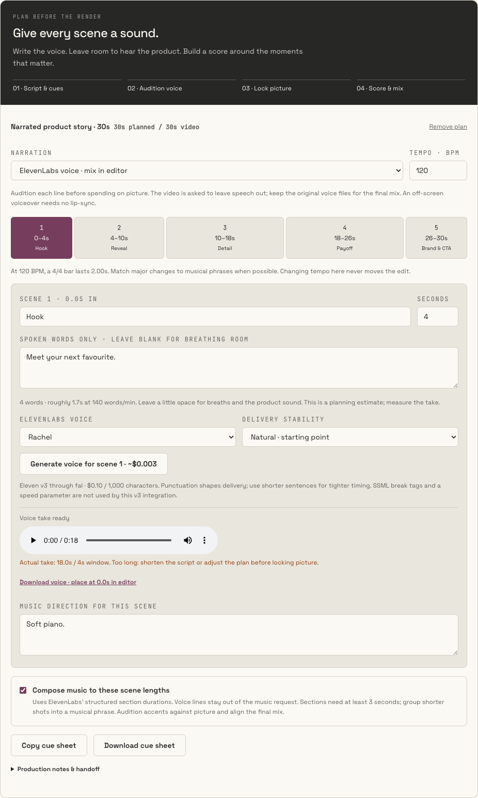
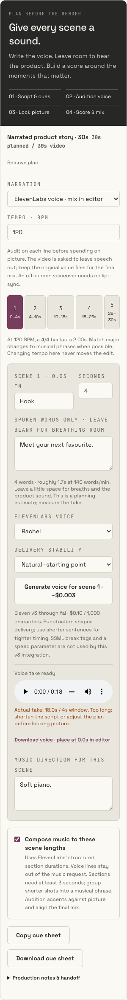

# Ad Lab: plan the voice, score the scenes, recover audio jobs

Implemented on **`codex/ad-lab-audio`**, based on **`11a6a5f`** from **`claude/loblaw-ai-content-studio-701jhf`**. The base was checked against GitHub on September 9, 2026. Read root `AGENTS.md` and the installed Next.js docs before editing. This is application code for review and merge by Claude, not a production deployment.

Ajwad asked whether ElevenLabs works through his existing fal connection, then asked for a clear voiceover and scene-music workflow for 30-second Seedance ads. This branch extends the Sound step without replacing the concept, Blender import, reference uploads, video generation, recovery or making-of walkthrough.

## Configuration finding

The deployed `/api/health` reported `fal: true`. Its anonymous session was locked, which is the intended live gate. The server already uses `FAL_KEY` for ElevenLabs music and effects as well as Seedance. The new voice endpoint uses it too. **No separate ElevenLabs key is needed for these fal-hosted endpoints.** No credential values were read. Presence does not prove account balance, model permissions or a successful paid audio generation; all generation tests in this work were mocked.

Defaults are:

| Job | fal endpoint | Estimate checked September 9, 2026 |
| --- | --- | --- |
| Music | `fal-ai/elevenlabs/music` | $0.60 per started minute; an 18s or 30s score is about $0.60 |
| Voice | `fal-ai/elevenlabs/tts/eleven-v3` | $0.10 per 1,000 input characters |
| Spot effect | `fal-ai/elevenlabs/sound-effects/v2` | $0.002 per second; 0.5–22s |

Sources: [Music pricing](https://fal.ai/models/fal-ai/elevenlabs/music), [voice pricing and schema](https://fal.ai/models/fal-ai/elevenlabs/tts/eleven-v3/llms.txt), [effects pricing and schema](https://fal.ai/models/fal-ai/elevenlabs/sound-effects/v2/llms.txt). Estimates can change; keep the registry current. `.env.example` documents the optional endpoint overrides, including `FAL_VOICE_ENDPOINT`.

## The production flow now shown in Sound

1. **Script and cues:** choose a narrated 30s story, a 30s product rhythm, or the 18s Cream in motion template. Edit a scene at a time in the timeline. Each has a duration, spoken line and music direction. The plan stays in this browser and can be copied or downloaded.
2. **Audition voice:** choose ElevenLabs for separate recordings, native narration for a first pass in the video, or no narration. ElevenLabs generates one scene's line per explicit click. Its price is visible. Word count gives a rough planning estimate at 140 words/minute; actual file duration is measured after generation and an overlong take is flagged. The speaking-rate estimate is our starting heuristic, not a provider guarantee.
3. **Confirm picture timing:** when story and narration are new, audition before committing to the visual edit. With an existing Blender guide, fit the script to its cuts. A duration mismatch blocks video generation until corrected; applying a template does not silently resize the video or analyze the guide.
4. **Score and mix:** optionally compose music using the scene lengths. Keep the voice, music and effects as separate files, lower music under speech, and place important effects against picture in an editor. The existing preview mixes the separate music bed with video for listening; it is not a finished export.

The default 30s structure is deliberately editable:

| Window | Story job | Sound direction |
| --- | --- | --- |
| 0–4s | Hook | Short opening line; sparse motif |
| 4–10s | Reveal | Introduce the pulse; leave speech clear |
| 10–18s | Detail | Product sounds between phrases |
| 18–26s | Payoff | Lift the arrangement without covering the voice |
| 26–30s | Brand and CTA | Brief final line; resolved musical tail |

At 120 BPM a 4/4 bar is 2 seconds, so these boundaries can sit on bar boundaries. A BPM request is musical guidance; it does not certify a generated track's beat positions. Match major changes to phrases, audition against picture, and adjust the final edit or score as needed.

The ice-cream music template groups the known Blender chapters into **0–5, 5–10, 10–15 and 15–18s**. This covers macro/spoon, spiral/flavours, runway/overhead and the hero hold. Short shots are grouped because music sections require at least 3 seconds. It does not change the original seven-shot film. The cue sheet is authored guidance; review the actual Seedance result for timing differences.

## Music sections and narration are different API inputs

**Free music brief:** sends `prompt`, `music_length_ms`, `force_instrumental: true` and MP3 output. For a separate edit bed it requests two seconds of handles; a track intended as a Seedance reference requests the cut length.

**Scene score:** sends `composition_plan` with fal's `positive_global_styles`, `negative_global_styles` and `sections` shape, plus `respect_sections_durations: true`. Section durations must sum to the cut. Narration is never put in `lines`; those arrays are empty. No top-level `prompt`, `music_length_ms` or `force_instrumental` is sent in this mode: those are prompt-mode fields. Styles request an instrumental score and exclude voices, and the UI asks the user to audition for unwanted vocals. Do not replace this with the newer direct ElevenLabs SDK's `chunks` schema without verifying fal's contract. [fal music API](https://fal.ai/models/fal-ai/elevenlabs/music/api)

**Voice:** sends spoken `text`, a listed `voice`, `stability` and automatic text normalization. The endpoint does not expose a duration or speed input here. XML/SSML markup is rejected before spending. The UI separates script from production notes. Natural punctuation, concise lines and auditioning pronunciation are the practical controls. [fal voice API](https://fal.ai/models/fal-ai/elevenlabs/tts/eleven-v3/api), [ElevenLabs voice guidance](https://elevenlabs.io/docs/overview/capabilities/text-to-speech/best-practices)

**Native narration:** appends exact quoted lines and intended audio windows to the video prompt. It requests one off-screen narrator and does not invent a talking presenter. **External narration:** asks the video to leave speech out so the original ElevenLabs files can be mixed later. The appended block takes precedence over earlier audio instructions only; imported visual direction stays intact. Silent mode still uses the API audio switch where supported. A native-narration/silent-mode conflict is blocked visibly.

## Using audio references with Seedance

Use the original Blender video for motion and the five existing images for appearance. A reference track can guide rhythm, mood or voice, but is not a guarantee of unchanged audio or exact beat sync. The original narration should remain available for the final mix.

For timing guidance, align the phrases on the cue sheet in an editor and upload **one full-length MP3/WAV guide** using the appropriate voice or rhythm reference role. The generated individual phrases begin at file time zero; the page does not insert the scene's leading silence. Do not upload a full 30-second score and another full 30-second voice track together: reference audio shares a **30.2-second combined allowance**. Keep separate originals for mixing even if using a combined guide as the reference. [Seedance reference API](https://fal.ai/models/bytedance/seedance-2.5/reference-to-video/api)

The UI measures reference duration before submitting, checks the visual companion requirement and count/combined-duration bounds, and reports conflicts near Sound. The server repeats duration checks when metadata is provided; older clients without it still reach provider validation. MP3/WAV replaces the previous unsupported M4A/AAC offer. The configured upload transport can impose a smaller size limit than the provider's 15 MB per audio file.

## Reliability and billing changes

- Music, SFX and voice submit to the fal queue and return a request ID promptly. `/api/ad/audio/status` polls only an allowlist of those three models. It never submits or charges for another generation.
- `useAudioJobs` saves up to 20 accepted handles in `adlab-audio-jobs-v1`. Reloaded or slow jobs can be checked again. Completed receipts retain download URLs. Transient status errors retry the same ID. An uncertain submission is never automatically repeated; if the response was lost before its ID arrived, check fal history first.
- The previous music estimate was wrong. Billing now rounds duration to a started minute. Reusing a matching generated track adds no new music estimate. Changing its relevant settings marks it stale instead of attaching it silently.
- Video submission finishes updating the session budget cookie before automatic separate music starts. New audio submissions are serialized within the page. Existing cross-tab budget behavior is unchanged.
- Native audio is the default for a quick first pass. Separate music/voice/effects remain explicit choices, and demo tones are labelled as synthetic mocks.
- The music preview follows play, pause, seek, buffering and playback speed, with drift correction and a level slider. The MP4 download is still the original video; no hidden muxing or export charge was introduced.

## Implementation and integration

- `src/components/studio/SoundPlanner.tsx`: timeline, templates, narration controls, voice preview/duration warning, cue-sheet actions and production notes.
- `src/lib/soundPlan.ts`: validated plan/section shapes, templates, voice choices, timing calculations and prompt builders.
- `src/lib/adAudio.ts`: scoped sound instruction block and reference constraints.
- `src/lib/useAudioJobs.ts`: queued audio submission, saved receipts and recovery.
- `src/app/ai-studio/ads/AdLab.tsx`: integrates the planner with video prompts, score generation, preflight, prices and playback.
- `src/app/api/ad/{music,sfx,voice}/route.ts`, `src/app/api/ad/audio/status/route.ts`, `src/lib/fal.ts`: provider payloads and queue handling. **Music/SFX live responses now return a pending request handle instead of an immediate `audioUrl`; merge the caller and routes together.** Demo responses still return a labelled mock audio URL.
- `src/lib/models.ts`, `src/lib/music.ts`, `src/lib/sfx.ts`, `src/lib/adPresets.ts`: pricing, lengths and capability guidance. Models page includes the three audio models.

No new dependencies. No voice cloning, automatic film analysis, batch generation, stem separation, alignment service or final MP4 mixing/export was added. Voice recordings remain downloadable through saved receipts after reload; the scene preview itself is current-tab state. Templates are starting material, not automatically approved advertising copy.

## Validation

- `node scripts/check-ad-audio.cjs`: portable contract tests, entirely mocked. Covers per-character/minute pricing, TTS/music/SFX payloads, mutually exclusive music modes, section totals, invalid inputs rejected before spend, narration scopes, reference limits and transient queue failures.
- Local Chrome checks: both narration paths, native/silent conflict, template/video duration mismatch, measured overlong voice, queued voice persistence, structured music without spoken copy, stale music, reference prerequisites, saved jobs after reload, playback/seek/speed/level, and a transient 503 without resubmission.
- Desktop and 768/390/320px widths: no page-wide horizontal overflow and no browser JavaScript errors.
- `npx tsc --noEmit`, `git diff --check` and `npm run build` passed, including all 17 static pages and the new routes.
- **No paid provider generation was run.** A live audition after merging is still needed to verify account access and judge the actual voice/music quality. Use a short spoken line for voice; remember music has a one-minute minimum bill.

The screenshots use a synthetic 18s test tone in a 4s narration window to demonstrate the overlong-take warning; they are not ElevenLabs output.

## Claude merge note

Merge `codex/ad-lab-audio` into the current `claude/loblaw-ai-content-studio-701jhf` after reviewing intervening changes. Keep the already merged cream comparison, loading-state recovery, reference encoding and negative-prompt fixes. This branch does not change the homepage or deploy Vercel. Re-run the contract checks and production build after merging, then audition an explicitly selected live voice/music request through the existing gate.
