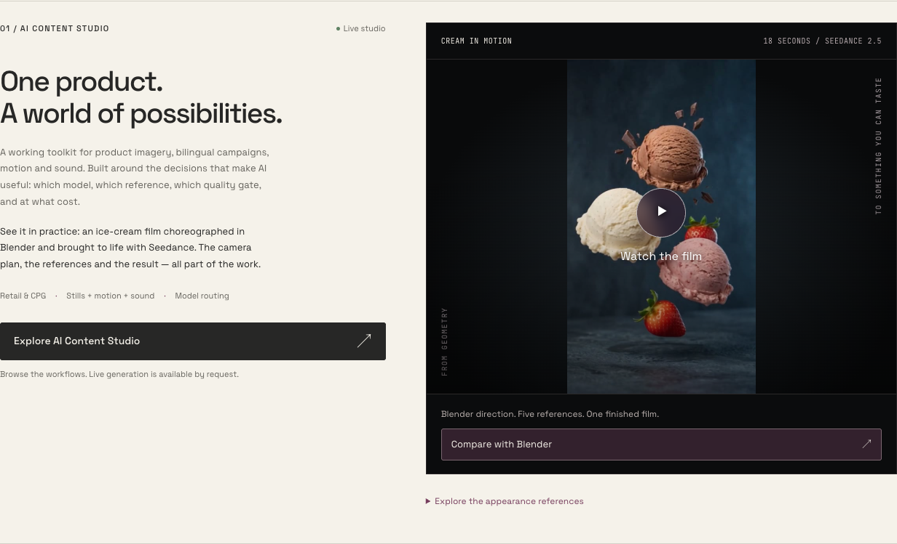
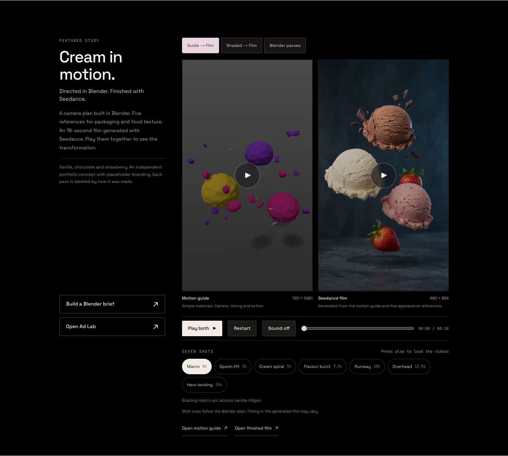
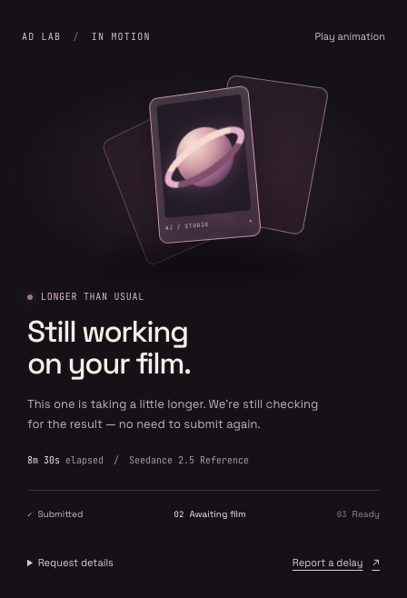

# Finished cream film + Ad Lab waiting animation

Implemented on `codex/cream-film-and-render-status`, based on `df085e0` of `claude/loblaw-ai-content-studio-701jhf` (the completed UX audit fixes). This branch contains application changes, not just design notes. It does not modify API routes or generation settings.

## What changed

- **Homepage:** the AI Content Studio project features the supplied Seedance film, with a real frame as its poster, an obvious Play action, native seek/audio/fullscreen controls once started, and a prominent link to the comparison. The appearance-reference triptych remains available in a disclosure. TOKEN, the interactive sculpture, the other projects, and their links remain intact.
- **AI Studio:** the featured study now defaults to Blender motion guide versus the finished Seedance film. Visitors can also choose shaded Blender versus Seedance or the original two Blender passes. Existing coordinated playback, scrubber, chapter shortcuts, restart, pause-offscreen behaviour and direct file links remain. Sound can be enabled on the Seedance output. Switching comparisons pauses and resets both videos.
- **Ad Lab:** the elapsed-time bar and speculative “Almost ready” status are replaced by an indeterminate animated film-frame composition in plum. Starting, active and delayed messages follow the existing application state. Elapsed time remains visible. There is a pause-animation control, automatic reduced-motion support, selectable/copyable request details, and the existing report-delay destination. Polling, timeout, recovery, provider payloads, spend calculations and the completed player are unchanged.

## Assets and provenance

The finished video is embedded directly from the URL Ajwad supplied:

`https://cd8lfvpdkybjxvfw.public.blob.vercel-storage.com/icecream-example/5T8tOp3A7U99ZSKVs9H_y_video.mp4`

Verified with ffprobe: H.264 video, 480×854, 24 fps, AAC audio, 18.041667-second container, 9,586,824 bytes. It is the actual Seedance 2.5 result, not an upscaled or regenerated version. The two other files remain explicitly labelled Blender output. All branding is portfolio placeholder branding.

Three small JPEG posters were extracted at 7.8 seconds so the comparison starts with the same three-scoop subject on each side. No additional MP4 is committed. All players use `preload="none"` and wait for user interaction; the browser checks verified no video was loaded on initial page arrival. Chapter times describe the Blender plan and are not a promise of frame-accurate alignment with generative output.

## Main files

- `src/components/studio/creamStudy.ts`: all three video sources, labels, dimensions and comparison choices.
- `src/components/studio/CreamCompare.tsx` and `.module.css`: comparison behaviour and presentation.
- `src/components/home/CreamFilm.tsx` and `.module.css`: homepage film player.
- `src/components/studio/RenderWaiting.tsx` and `.module.css`: waiting-state presentation only; no API calls.
- `src/app/page.tsx`, `src/app/ai-studio/page.tsx`, `src/app/ai-studio/ads/AdLab.tsx`: integration.

The waiting screen must not add fake completion percentages or infer model-internal stages from elapsed time. The existing provider adapter exposes pending/done/failed, not a measured render percentage. The visual is decorative activity. The ten-minute recovery behaviour remains unchanged.

## Validation

- Production `npm run build` passed, including TypeScript and all routes.
- `npx tsc --noEmit` passed after Next generated its route types.
- Homepage and AI Studio checked at 1440, 736, 390 and 320px; no page-wide horizontal overflow.
- Verified real supplied-video playback, paired pause, shared seek to 15s, all comparison choices, independent Seedance sound, offscreen pause, and homepage native controls/audio.
- Tested starting, running and overdue loading states, animation pause, reduced-motion mode, request details, timeout recovery and collection into the completed video player.
- All generation and status calls in these tests were intercepted and mocked locally. No paid generations were submitted.

Read root `AGENTS.md` and the installed Next.js docs before further edits. Review the latest implementation branch before merging if it has moved. This handoff does not assert a production deployment has happened.

## Visual previews

