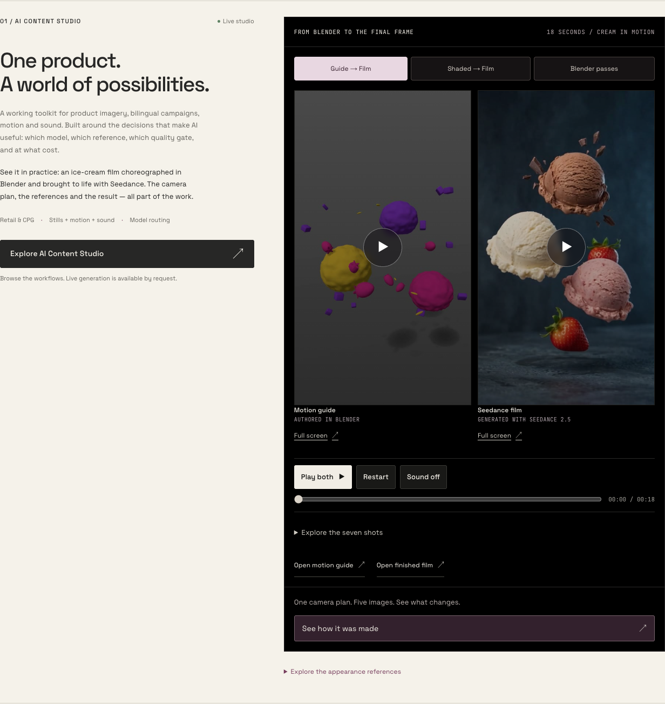
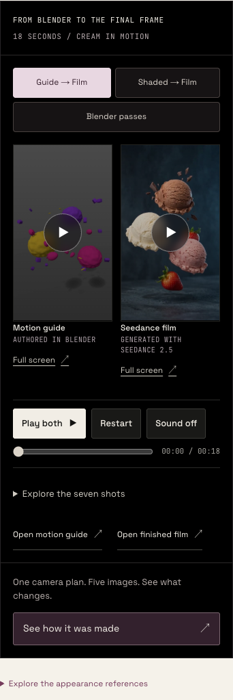
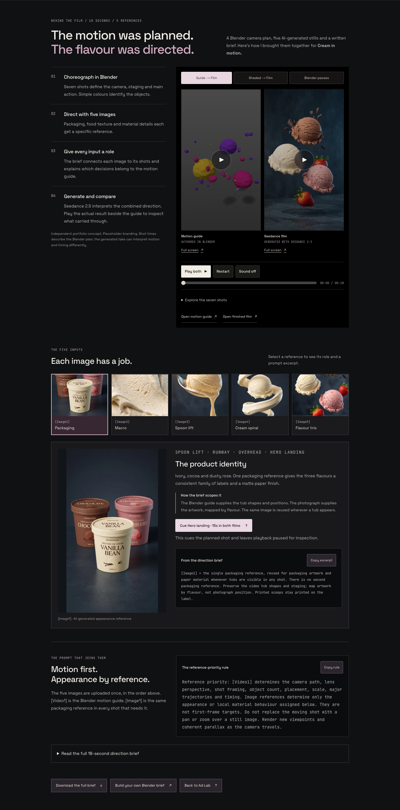
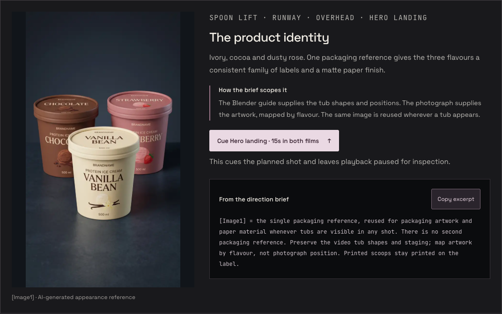

# Show the making on home; explain the five references in Ad Lab

Implemented on `codex/cream-making-of`, based on `cce223c` from `claude/loblaw-ai-content-studio-701jhf`. Read root `AGENTS.md` and the installed Next.js docs before editing. This branch preserves Claude’s latest provenance labels, loading-copy corrections and anchor fix.

Ajwad wants visitors to see the Blender-to-Seedance transformation immediately on the homepage, and to walk through how the five images and written direction shaped the film on `/ai-studio/ads`.

## What to merge

This is application code, with a working local preview. Merge this branch into the current production branch after checking for intervening changes. Production remains `claude/loblaw-ai-content-studio-701jhf`, not `main`. This handoff does not claim that production has been deployed.

- **Homepage:** replaces the solo Seedance player with the shared paired comparison. The initial view is the Blender motion guide beside the actual finished film, with both posters visible. All three comparison choices remain available. The main action says **See how it was made**, linking directly to `/ai-studio/ads#cream-making-of`. On phones the comparison appears ahead of the project description. Existing portfolio projects, TOKEN film, sculpture, reference disclosure and Studio link remain.
- **Ad Lab:** adds a prominent making-of jump link near the page title and an independent walkthrough after the generation workspace. It explains the four steps: Blender choreography, five appearance references, the reference-role prompt and the generated result. Visitors can inspect all five inputs, select an image, read its intended contribution and scope, copy its prompt excerpt, and cue the planned shot in both films.
- **Studio overview:** retains its existing comparison and adds a direct link to the references and prompts. It shares the same comparison component with the other placements.

## Five images, uploaded once each

| Prompt reference | Image | Intended use | Cue |
| --- | --- | --- | --- |
| `[Image1]` | Packaging | Artwork and matte paper wherever a tub is visible; reused across shots | Hero landing, 15s |
| `[Image2]` | Vanilla macro | Seeds, pores, scoop ridges and ivory folds | Macro, 0s |
| `[Image3]` | Spoon lift | Steel, scoop texture and brief local cream adhesion | Spoon lift, 2s |
| `[Image4]` | Cream spiral | Ribbon material, thickness and rounded edges | Spiral, 5s |
| `[Image5]` | Flavour trio | Scoop colours and ingredient materials; filling textures only for the overhead | Flavour burst, 7.5s |

`[Video1]` is the existing 18-second Blender motion guide. The five WebP files are optimized copies of Ajwad’s actual JPEG reference set, including the updated BRANDNAME packaging. Together they are approximately 472 KiB. Full reference previews preserve the entire image; thumbnails are cropped for navigation. These are AI-generated appearance references, labelled as such, and the packaging is a portfolio placeholder.

The prompt excerpts and reference-priority rule come from the consolidated five-reference brief prepared earlier in the project. The full brief is available in a disclosure, through a Copy button, and as `/studio/cream/direction-18s.txt`. Keep that download and `creamPrompt.ts` identical if revising the brief. The page does not claim to contain a captured final API request: the written brief asks for no generated audio, while the actual supplied result contains audio. The final request settings were not available for verification.

## Behaviour to preserve

- `CreamCompare` now accepts optional `compact`, `id` and `cue` props. There is still one playback implementation: shared play/pause, restart, seek, drift correction, comparison switching, source errors, offscreen pause and Seedance sound.
- A reference cue pauses and seeks both films, then moves keyboard focus and the viewport to the comparison. It does not automatically play or generate anything.
- All video elements use `preload="none"`. Initial posters show the transformation without downloading or autoplaying the videos. User interaction loads them.
- Fullscreen buttons are available per film, with native controls during standard fullscreen and a Safari fallback. Direct file links remain available.
- Shot navigation is open on the Studio overview and collapsed in compact placements. Times describe the Blender plan; the output may interpret motion and timing differently.
- Reference exploration is separate from `AdLab` state. It does not change its uploads, prompts, presets, generation request, polling, costs, recovery, or access controls. All API routes and provider payloads are untouched.

## Main files

- `src/components/home/CreamFilm.tsx` and `.module.css`: homepage framing and making-of CTA.
- `src/components/home/home.css`: comparison column width, mobile ordering, lower-specificity button/input font reset so shared component styles work.
- `src/components/studio/CreamCompare.tsx` and `.module.css`: shared compact mode, unique section IDs, reference cues and fullscreen controls.
- `src/components/studio/CreamMakingOf.tsx` and `.module.css`: walkthrough, image selection, scoped direction, copying and full brief.
- `src/components/studio/creamReferences.ts`: five reference roles, shot cues and excerpts.
- `src/components/studio/creamPrompt.ts` and `public/studio/cream/direction-18s.txt`: consolidated direction brief.
- `public/studio/cream/references/`: five optimized images. No new video copies or dependencies.
- `src/app/ai-studio/ads/page.tsx`: separate walkthrough below the existing workspace.
- `src/app/ai-studio/ads/AdLab.tsx`: making-of link and return-anchor ID only.

## Validation

Browser checks used isolated Chrome with all generation APIs intercepted. No paid requests were submitted.

- Home, Studio overview and Ads at 1440, 768, 390 and 320px: no page-wide horizontal overflow; no video loaded on initial arrival.
- Actual supplied Seedance and local Blender videos: coordinated play/pause, all five cues at the intended times, all three comparison choices, sound only on the generated film, homepage chapter seek and offscreen pause.
- All five image selections and copyable excerpts; full-brief clipboard text exactly matches the download.
- Final mobile comparison-first ordering, fullscreen native controls and cleanup on exit, keyboard focus after reference cue.
- No browser JavaScript exceptions. `npx tsc --noEmit` and the production `npm run build` passed, including all 17 static pages.

## Previews

