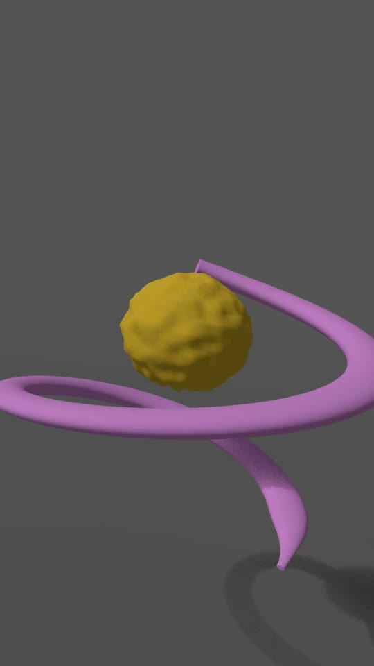
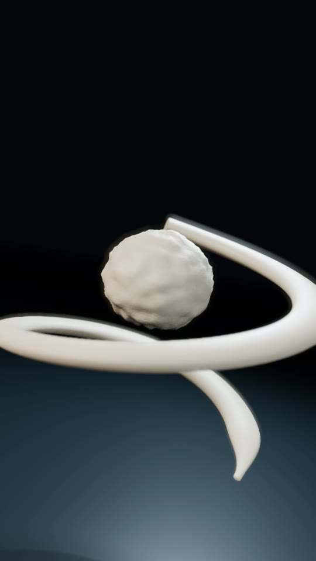

# AI Content Studio overview — Claude handoff

**[Read the implementation brief](CLAUDE_HANDOFF.md).**

This branch supplies the two real ice-cream Blender movies, matching posters, and a focused brief for improving `/ai-studio`. It contains **no implemented page redesign**. Claude should apply the brief to its current application checkout.

Branch: `codex/studio-overview` · reviewed base: `3854053` of `claude/loblaw-ai-content-studio-701jhf`.

| Motion guide | Shaded Blender render |
| --- | --- |
|  |  |
| [Open 720 × 1280 movie](../../public/studio/cream/motion-guide.mp4) | [Open 1080 × 1920 movie](../../public/studio/cream/shaded-render.mp4) |
| Simple materials; camera, timing and action | Higher fidelity; lighting, texture and flavour colours |

Both clips are silent H.264 files, **18 seconds, 24 fps, 9:16**, with the same seven-shot edit. The images above are matching frames at 6.1 seconds. Both movies are authored Blender outputs; neither is a Seedance-generated final.

The video assets total approximately 7 MB. No generation keys, API calls, Blender installation or third-party video player are required to display them. [Media manifest](media.json) records exact metadata and SHA-256 checksums.

Automatic Vercel deployment is disabled for this exact handoff branch in root `vercel.json`. The deploying branch and live page have not been changed. The guard does not cover differently named implementation branches.
